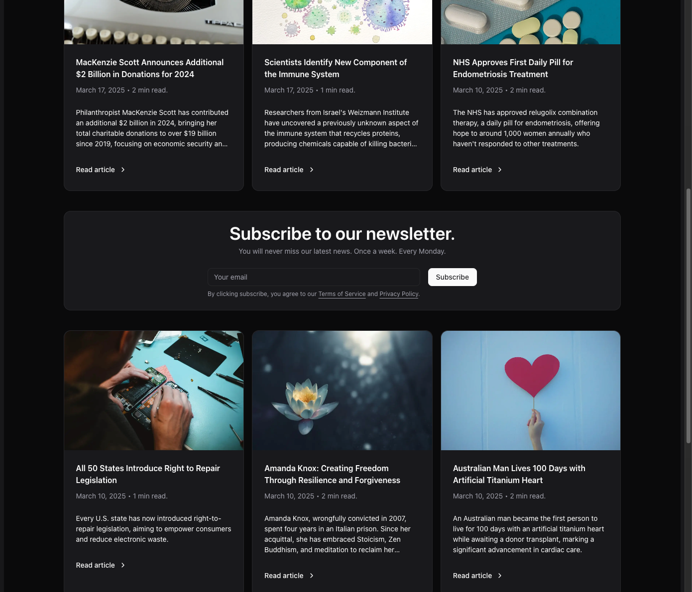

# Uplifting News

A place to read positive and uplifting, feel good news stories.

### Description

The Uplifting News is a platform that provides users with exclusively positive news from around the world. In an era dominated by negative media content, the application's goal is to improve mood, inspire, and foster a positive outlook on reality.

- Displays the latest positive news in a visually appealing format.
- Allows users to subscribe to a weekly newsletter to receive new positive news in their email inbox.
- Provides content filtering to select news by category (e.g., health, entertainment, science, business).
- Allows users to share news via social media.
- Allows users to switch between light and dark mode for a more comfortable reading experience.
- Optimized for SEO to improve discoverability in search engines.

### Target

The application is aimed at individuals seeking positive information and looking to escape the negative media narrative. Potential users include:

- People who care about mental health and well-being.
- Office workers searching for inspiring content during the day.
- Families and educators wanting to share positive stories with children.
- Elderly individuals who frequently consume news and may need more optimistic content.

### Technology

TypeScript, React, Next.js, TailwindCSS, shadcn/ui, Prisma (ORM), PostgreSQL, react-hook-form, zod.

### Screenshots

